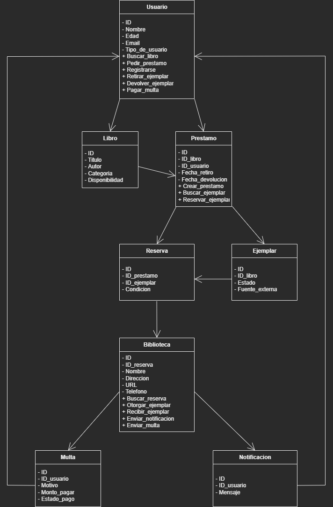

# 🦴 Diagrama de Dominio

Este diagrama tiene la funcionalidad de mostrar las principales entidades del sistema de gestión bibliotecaria y sus relaciones, reflejando la estructura conceptual sobre la cual se construye la lógica del negocio del sistema.

---

Las entidades que conforman el dominio son: **Usuario**, **Libro**, **Prestamo**, **Reserva**, **Biblioteca**, **Notificacion** y **Multa**.

El flujo general de interacción entre estas entidades es el siguiente:
- El Usuario puede realizar varias acciones, desde buscar un Libro hasta pedir un Prestamo.
- El Libro representa la obra en general, mientras que el Ejemplar es su copia específica, que puede ser física o provenir de una fuente externa.
- El Prestamo se encarga de buscar el Ejemplar y realizar una Reserva para el Usuario.
- A través de una Reserva, el Usuario puede retirar el Ejemplar en la Biblioteca.
- La Biblioteca centraliza la gestión de préstamos, reservas y ejemplares, y además puede emitir Multas o Notificaciones según el comportamiento del Usuario.

Esto proporciona una **visión clara y estructurada** del funcionamiento interno del sistema, sirviendo como **base conceptual** para el diseño y el desarrollo posterior del sistema.

## Imagen

